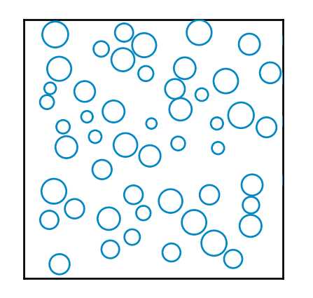

# collision

This small Python project is a physical simulation of two-dimensional physics. For more information, see [my scipython.com blog post](https://scipython.com/blog/two-dimensional-collisions/).

